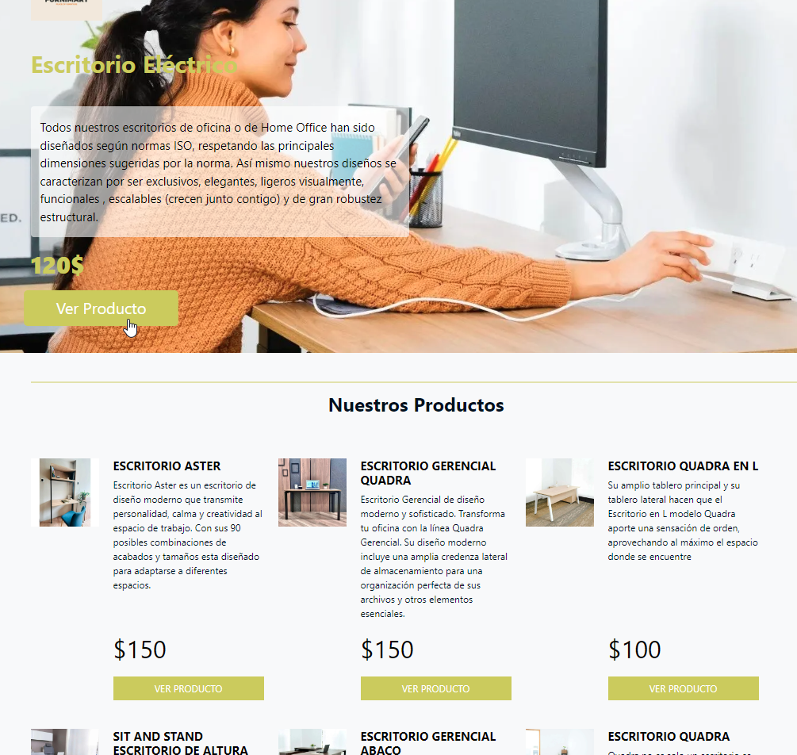
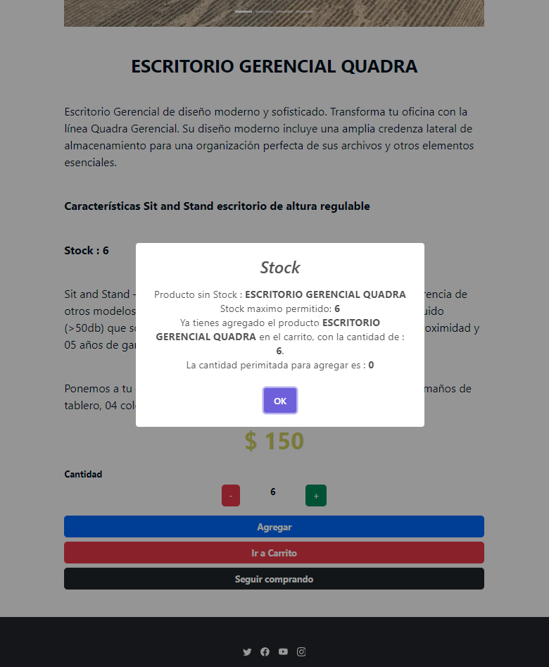
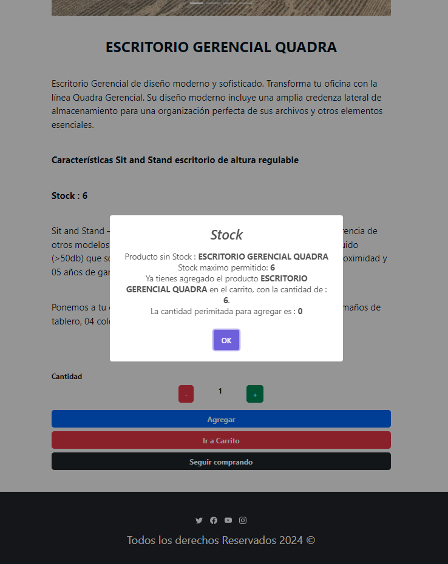
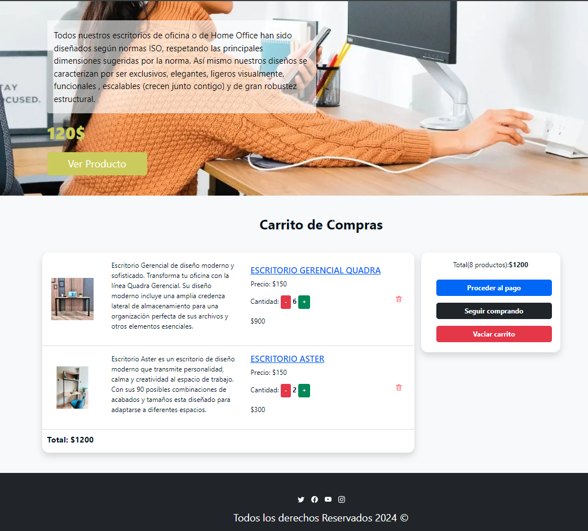
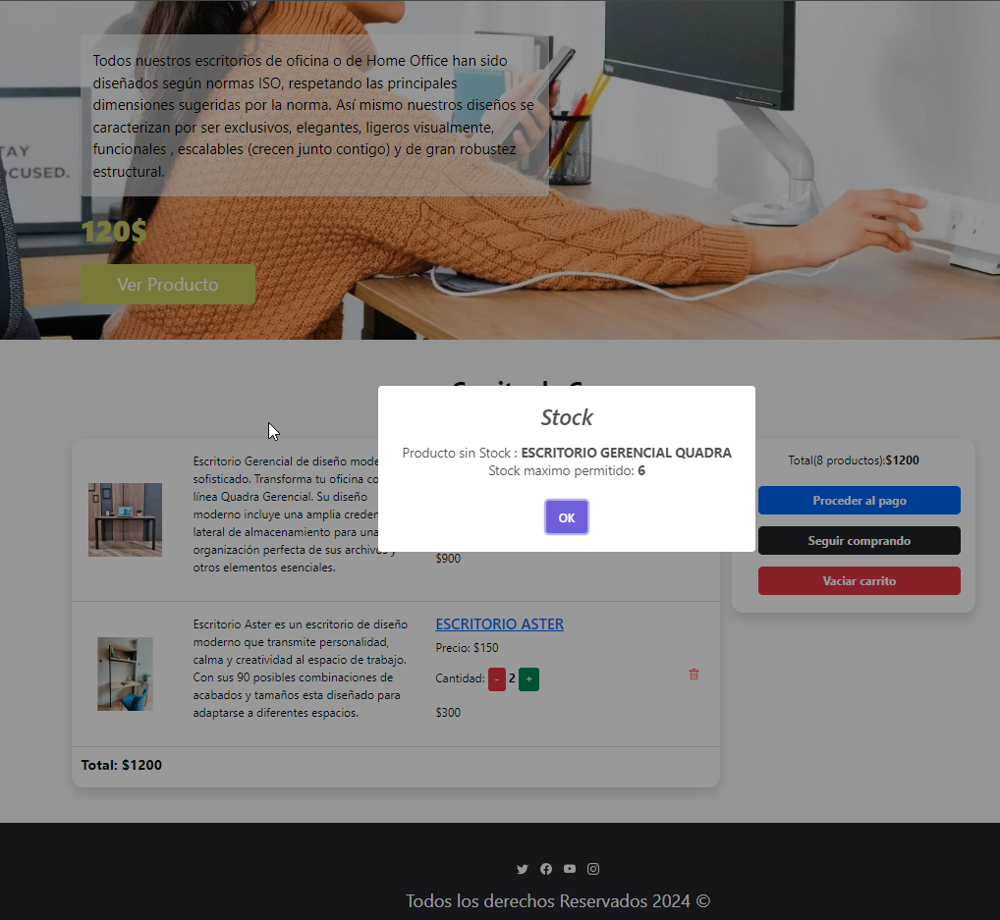
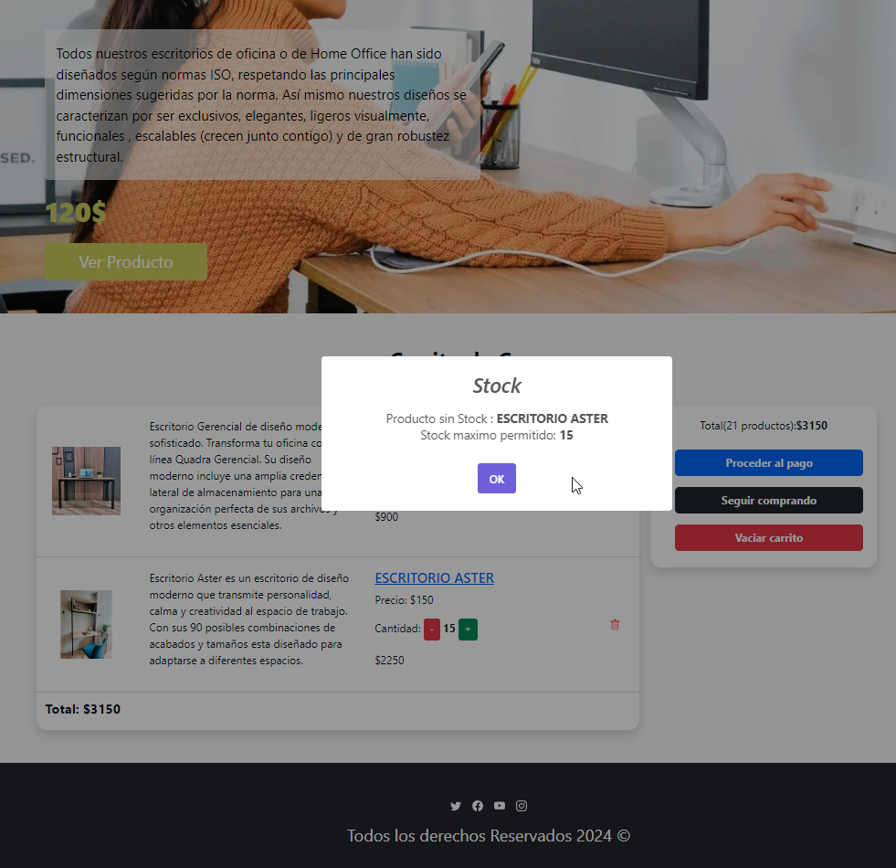
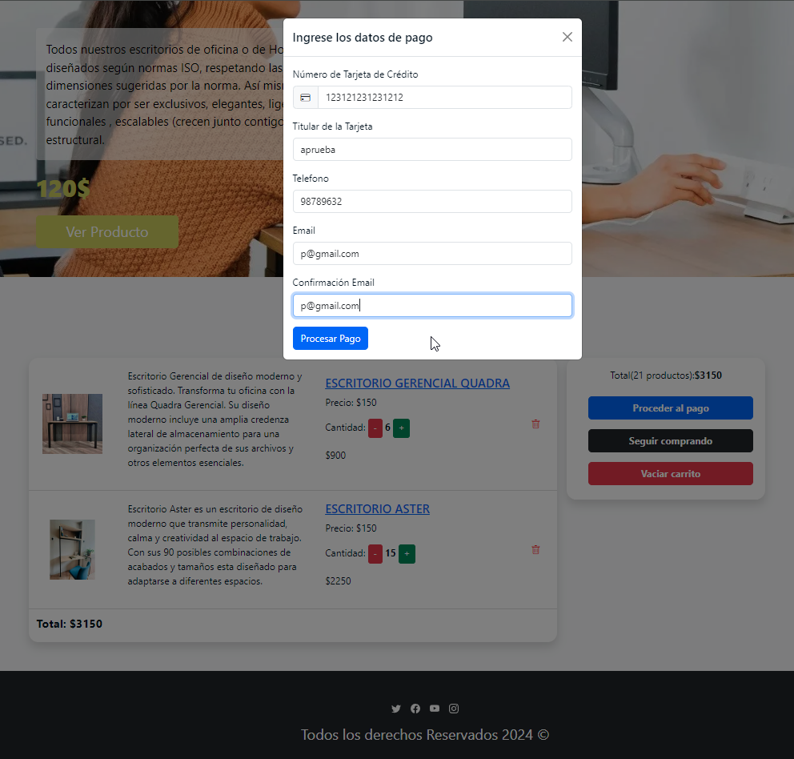
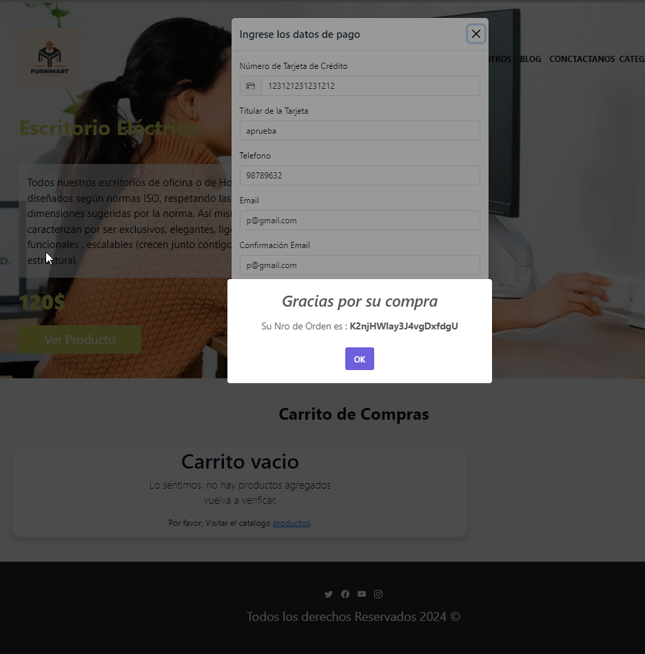

# Proyecto E-COMMERCE con REACT + VITE

## Desarrollador
Jefferson Ore.

## Librerias o recursos utilizados

[sweetalert](https://sweetalert2.github.io/)
[bootstrap](https://getbootstrap.com/docs/5.3/forms/overview/)
[canvas confetti](https://www.npmjs.com/package/canvas-confetti)
[firebase](https://firebase.google.com/)
[react toastify](https://www.npmjs.com/package/react-toastify)

## Proposito del proyecto
Este proyecto es un carrito de compras realizado con **react**

## Funcionalidades del proyecto
Este proyecto permite simular una compra de productos de escritorio agregar distintos tipos de productos al carrito, eliminar y actualizar dependiendo del stock.

## Como inicializar el proyecto
- Ingresar a la terminal
- Escribir el siguiente comando para instalar los paquetes requeridos: **npm install** o **npm i**
- Luego escribir el siguiente comando para inicializar el proyecto : **npm run dev**

**Nota:** El proyecto una vez abierto ya realiza los paso mencionados anteriormente si es que se abre en el vscode

- Tambien es necesario crear el archivo .env que tiene las variables con cual se conecta al firestore los campos son :
> VITE_FIREBASE_API_KEY = ""\
> VITE_FIREBASE_AUTH_DOMAIN = ""\
> VITE_FIREBASE_PROJECT_ID = ""\
> VITE_FIREBASE_STORAGE_BUCKET = ""\
> VITE_FIREBASE_MESSAGING_SENDER_ID = ""\
> VITE_FIREBASE_APP_ID = ""

- En caso se tenga problemas enviar un correo al desarrollador : [correo](jeffer.ore@gmail.com)

## Pantallas de la aplicacion

## Gif de la aplicacion
